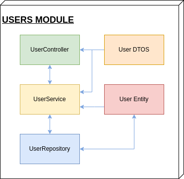
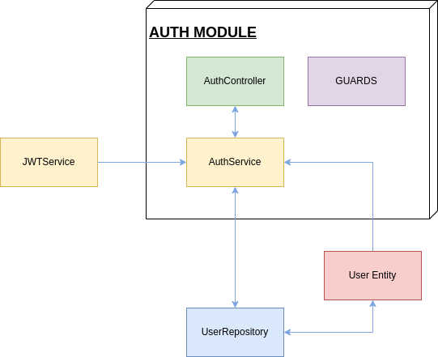
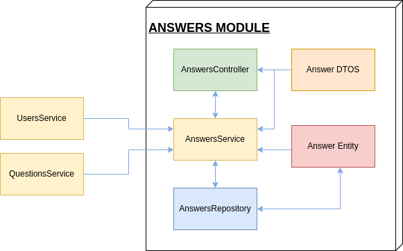
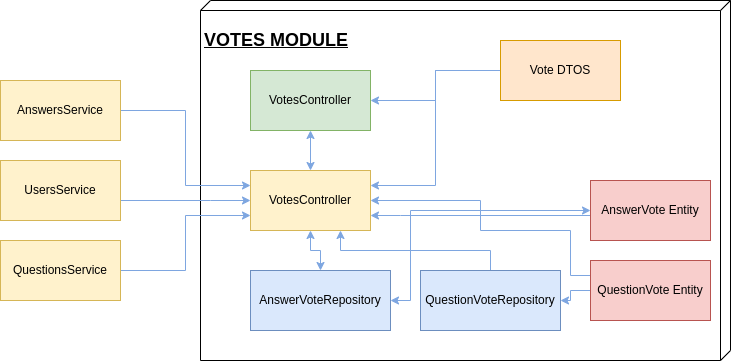

<style>
.get {
  display: inline-block;
  padding: 0 5px;
  height: 25px;
  font-size: 16px;
  line-height: 25px;
  border-radius: 25px;
  background-color: #00ff00;
  color: black;
  font-weight: bold;
  margin-right: 15px;
  margin-top:10px;
}
.post {
  display: inline-block;
  padding: 0 5px;
  height: 25px;
  font-size: 16px;
  line-height: 25px;
  border-radius: 25px;
  background-color: #ffff00;
  color: black;
  font-weight: bold;
  margin-right: 15px;
  margin-top:10px;
}
.patch {
  display: inline-block;
  padding: 0 5px;
  height: 25px;
  font-size: 16px;
  line-height: 25px;
  border-radius: 25px;
  background-color: #0000ff;
  color: black;
  font-weight: bold;
  margin-right: 15px;
  margin-top:10px;
}
.delete {
  display: inline-block;
  padding: 0 5px;
  height: 25px;
  font-size: 16px;
  line-height: 25px;
  border-radius: 25px;
  background-color: #ff0000;
  color: black;
  font-weight: bold;
  margin-right: 15px;
  margin-top:10px;
}
</style>


<p align="center">
  
  <h1 align="center">QUEUE OVERFLOW</h1>
</p>

## Instalation

Make sure that you have node installed before attempting to run this project. After you installed node, you can run the bellow command in the folder of the project to install all of the dependencies.

```bash
$ npm install
```

You also need to have an instance of maria DB to connect to, as well as a test database. The database can be
configured in the [main module of the application](./src/app.module.ts).

You can generate and seed a test database by running [this script](./generateDb). This database will contain two already created users:

- A normal user with email: `testuser@gmail.com` and password `testpassword`
- A moderator user with email: `testmoderator@gmail.com` and password `testpassword`

## Running the app

After installing the dependencies and having configured the database, you can run the backend on localhost using any of the bellow commands. By default, the app will listen on port `3000`.

```bash
# development
$ npm run start

# watch mode
$ npm run start:dev

# production mode
$ npm run start:prod
```

# Structure of the project.

The project is structured according to a layered architecture. The Controllers layer handles the comunication with the outside world. Its repsonsibility is to route incoming requests to the proper controllers and to make useful calls to the service layer in order to return the requested resources or initiate the operations.

The service layer contains the business logic of our API. It handles all the business operations and implements the functionality we need from our API.

The Data access layer performs the communication with the database. It handles data persistance and querying through the repository pattern.
<p align="center">

</p>

Not mentioned here are the entities that NestJS generates. In the ODM, these entities are persisted to the database but they are accessible from any layer. They are also useful in the service layer, because they also act as our app's Models.

To easely access all the resources any component in any layer needs, nestJS implements a powerful and flexible dependency injection and scoping system. This is done by grouping every domain in our application in a module. Every module has four components:

- **Imports:** define the resources that come from outside the module 
- **Exports:** define the resources that can be imported by other modules.
- **Providers:** define the providers (services / helpers / etc...) that can be imported by other modules.
- **Controllers:** define the controllers that our module exports to the app.

Our app is characterized by five main domains or functionalities:

- **Users**: Handles all CRUD operations regarding users
- **Questions**: Handles all CRUD operations regarding questions 
- **Answers**: Handles all CRUD operations regarding answers. 
- **Tags**: Handles tag fetching and creation.
- **Votes**: Handles the votes system operations (like / dislike answers or questions)
- **Auth**: Handles authentification and authorization operations.

# Modules

## Users

The users module handles the operations on the users of our application. A user has the following entity [structure](./src/users/entities/user.entity.ts):

- **id**: An unique identifier for the database.
- **email**: Email the user registered with.
- **passwordHash**: The hash of the password the user registered with.
- **role**: The role of the user. Can be either `NORMAL` or `MODERATOR`.
- **score**: The score of the user.

The diagram of this module is the following:

<p align="center">
  
</p>

You can notice the layered architecture where the controller only interacts with the user service, while the service interacts with the repository ant returns the results of its operations back to the controller. The user DTOs are data transfer objects that model the body of our requests. for example the [dto for creating a user](./src/users/dto/create-user.dto.ts) has the following fields which must appear in the body of the POST request.

```typescript
export class CreateUserDto {
  @IsNotEmpty()
  @IsEmail()
  @IsString()
  email: string;

  @IsNotEmpty()
  @MinLength(8)
  password: string;

  @IsNotEmpty()
  role: UserRole;
}
```
The decorators used in the definition serve for data validation.

## Endpoints

<p class="get">GET</p> localhost:3000/users

### Retrieves all the registered users

Sample output
```JSON
[
  {
      "id": 4,
      "email": "testuser@gmail.com",
      "role": "normal"
  },
  {
      "id": 5,
      "email": "testmoderator@gmail.com",
      "role": "moderator"
  }
]
```
<p class="get">GET</p> localhost:3000/users/:id

### Retrieves a registered user based on his id.

> id: the id of the user to be retrieved

- Can return `NOT_FOUND` if the user doesn't exist

Sample output
```JSON
{
    "id": 4,
    "email": "testuser@gmail.com",
    "role": "normal"
}
```

<p class="post">POST</p> localhost:3000/users

### Given a body, creates a user in the database. Returns the created user object.

- Can return `BAD_REQUEST` if body is improperly formated.

- Method can be accessed without a Bearer Token.

Sample **body**
```JSON
{
    "email": "testuser@gmail.com",
    "password": "testpassword",
    "role": "normal"
}
```
Sample output
```JSON
{
    "id": 4,
    "email": "testuser@gmail.com",
    "role": "normal"
}
```

<p class="patch">PATCH</p> localhost:3000/users/:id

### Given a body, and id, updates the user in the database.

> id: the id of the user to be retrieved

- Can return `NOT_FOUND` if id doesn't match any user

- Can return `BAD_REQUEST` if body is improperly formated.

- Method can return `FORBIDDEN` if user is not a `MODERATOR`

Sample **body**
```JSON
{
    "email": "testuser@gmail.com",
    "role": "moderator"
}
```
> If exectued sucessfuly, returns OK (200)

<p class="delete">DELETE</p> localhost:3000/users/:id

### Given an id. It will delete a user in the database.

> id: the id of the user to be deleted

- Method can return `FORBIDDEN` if user is not a `MODERATOR`

> If exectued sucessfuly, returns OK (200) 

## Auth

The auth module handles authentification. The user can use local authentification where he must provide a username and password on every request, or he can log in and get a JWT token from the login route.

<p align="center">
  
</p>

Guards are decorators tha can be applied to endpoints to decide wheter a request is routed to that controller or not. Here, the auth module exports JWT and local guards to be used globally.

These guards will act as protectors of our endpoints. If on a non-`Public` endpoint you don't provide a valid JWT token, it will return an `UNAUTHORIZED` response.

## Endpoints

<p class="post">POST</p> localhost:3000/auth/login

### Given a username and password, will log the user in and return a JWT

- Can return `BAD_REQUEST` if body is improperly formated.

- Method can be accessed without a Bearer Token.

Sample **body**
```JSON
{
    "username": "testuser@gmail.com",
    "password": "testpassword",
}
```
Sample output
```JSON
{
    "token": "aihsbduahbsdoiuhanwhdbaiksjbndkajhsdasdmkoanoi3uw4h92187u3bd"
}
```

## Questions

The questions module handles CRUD operations on questions. The user can create, retrieve questions, update a question or delete it if he is an `MODERATOR`. It relies on the Tags module as well for creation and persistance of tags.

The tags service exposes a single method that will search a list of tags in the database. If a tag in that list does not exist in the database, it will be created.

The questions service also depends on the user service to be able to link a question with its author based on an id. This is a many to one relationship because an author can have multiple questions while a question can have only one author.

<p align="center">
  
</p>

## Endpoints

<p class="get">GET</p> localhost:3000/questions

### Retrieves all the questions ordered by date of creation descendingly.

Sample output
```JSON
[
    {
        "id": 3,
        "title": "haha?",
        "text": "fo realzies???",
        "createdAt": "2022-03-15T20:36:04.000Z",
        "clout": 0,
        "author": {
            "id": 4,
            "email": "testuser@gmail.com",
            "passwordHash": "$2b$10$iPstnmNDf9L/cwWeqJBzVOmpomRMpu1CkBPvlMuG/QQG2YFzjicgu",
            "role": "normal",
            "score": 17
        },
        "tags": [
            {
                "identifier": "life"
            }
        ]
    },
    {
        "id": 2,
        "title": "How do I code my SD assignment?",
        "text": "yes",
        "createdAt": "2022-03-15T20:32:29.000Z",
        "clout": -1,
        "author": {
            "id": 1,
            "email": "mathildagray@gmail.com",
            "passwordHash": "$2b$10$hfvnohSbPEUgQ4WKowd2xe/4a5K8SzESOGxVJp9tEXvlxrsdnXUAq",
            "role": "normal",
            "score": -2
        },
        "tags": [
            {
                "identifier": "nestjs"
            },
            {
                "identifier": "softwaredesign"
            }
        ]
    }
]
```
<p class="get">GET</p> localhost:3000/questions/:id

### Retrieves a question based on its id.

> id: the id of the user to be retrieved

- Can return `NOT_FOUND` if the question doesn't exist

Sample output
```JSON
{
    "id": 2,
    "title": "How do I code my SD assignment?",
    "text": "yes",
    "createdAt": "2022-03-15T20:32:29.000Z",
    "clout": -1,
    "author": {
        "id": 1,
        "email": "mathildagray@gmail.com",
        "passwordHash": "$2b$10$hfvnohSbPEUgQ4WKowd2xe/4a5K8SzESOGxVJp9tEXvlxrsdnXUAq",
        "role": "normal",
        "score": -2
    },
    "tags": [
        {
            "identifier": "nestjs"
        },
        {
            "identifier": "softwaredesign"
        }
    ]
}
```

<p class="get">GET</p> localhost:3000/questions/title/:title

### Retrieves all the questions ordered by date of creation descendingly that partially match the provided parameter.

> title: a partial string to be retrieved. 

> Output is similar to previous requests.


<p class="get">GET</p> localhost:3000/questions/tag/:tag

### Retrieves all the questions ordered by date of creation descendingly which have the specified tag.

> tag: the id of the searched tag. 

> Output is similar to previous requests.

<p class="post">POST</p> localhost:3000/questions

### Given a body, creates a new question.

- Can return `BAD_REQUEST` if body is improperly formated.

> The author id can be **ommited** because it can be extracted from the Bearer token.

Sample **body**
```JSON
{
    "title": "How do I code my SD assignment?",
    "text": "Ok, so i'm kind of confused on how do I code stuff on...",
    "tags": [
        "softwaredesign",
        "nestjs"
    ]
}
```
Sample output
```JSON
{
    "text": "Ok, so i'm kind of confused on how do i code certain aspects of my SD assigment...asda",
    "title": "How do I code my SD assignment?",
    "tags": [
        {
            "identifier": "softwaredesign"
        },
        {
            "identifier": "nestjs"
        }
    ],
    "answers": [],
    "author": {
        "id": 5,
        "email": "testmoderator@gmail.com",
        "passwordHash": "$2b$10$4G5cMl9Exooy6PDQHTglqOmIOs6P0dugU8VYb79jWNbiZ7vQLA8bm",
        "role": "moderator",
        "score": 0
    },
    "id": 4,
    "createdAt": "2022-03-16T01:27:50.000Z",
    "clout": 0
}
```

<p class="patch">PATCH</p> localhost:3000/question/:id

### Given a body, and id, updates the user in the database.

> id: the id of the user to be retrieved

- Can return `NOT_FOUND` if id doesn't match any question

- Can return `BAD_REQUEST` if body is improperly formated.

- Method can return `FORBIDDEN` if user is not a `MODERATOR` or `THE AUTHOR OF THE QUESTION`

Sample **body**
```JSON
{
    "text": "... **fixed typo sry"
}
```
> If exectued sucessfuly, returns OK (200)

<p class="delete">DELETE</p> localhost:3000/questions/:id

### Given an id. It will delete a question in the database.

> id: the id of the user to be deleted

- Can return `NOT_FOUND` if id doesn't match any question

- Method can return `FORBIDDEN` if user is not a `MODERATOR`

> If exectued sucessfuly, returns OK (200) 


## Answers

The answers are stored as a one to many relationship in the database. Each question can have many answers, but an answer can have only one question. When we retrieve a question, we will attach its answers with it, so we do not have to create an endpoint in this module for retrieving the answers of a question.

The diagram for the answers is similar to the one from the questions module. It only depends on the user and the questions service to be able to construct its relations.


<p align="center">
  
</p>

## Endpoints


<p class="post">POST</p> localhost:3000/answers

### Given a body, creates a new answer.

- Can return `BAD_REQUEST` if body is improperly formated.

> The author id can be **ommited** because it can be extracted from the Bearer token.

Sample **body**
```JSON
{
    "question": 2,
    "text": "NOOO, u can't use typescript. It's slow and bloated!!!11! and it sucks! Use the right eNtErpRisE tOOl!!! https://spring.io/"
}
```
Sample output
```JSON
{
    "text": "NOOO, u can't use typescript. It's slow and bloated!!!11! and it sucks! Use the right eNtErpRisE tOOl!!! https://spring.io/",
    "author": {
        "id": 5,
        ...
    },
    "question": {
        "id": 2,
        ...
    },
    "id": 4,
    "clout": 0,
    "createdAt": "2022-03-16T01:40:40.000Z"
}
```
<p class="patch">PATCH</p> localhost:3000/answers/:id

### Given a body, and id, updates the answer in the database.

> id: the id of the user to be retrieved

- Can return `NOT_FOUND` if id doesn't match any answer

- Can return `BAD_REQUEST` if body is improperly formated.

- Method can return `FORBIDDEN` if user is not a `MODERATOR` or `THE AUTHOR OF THE QUESTION`

Sample **body**
```JSON
{
    "text": "Best thing is NestJs! Trust me bro! I'm based: https://docs.nestjs.com/"
}
```
> If exectued sucessfuly, returns OK (200)

<p class="delete">DELETE</p> localhost:3000/answers/:id

### Given an id. It will delete a answer in the database.

> id: the id of the answer to be deleted

- Can return `NOT_FOUND` if id doesn't match any answer

- Method can return `FORBIDDEN` if user is not a `MODERATOR` or `THE AUTHOR OF THE ANSWER`

> If exectued sucessfuly, returns OK (200) 

## Votes

The votes module handles the voting functionality. You can vote answers and questions, but you cannot vote on your own answers and questions. For every vote, the user's score which you voted will be altered and maybe the voting users as well.


<p align="center">
  
</p>

The votes module has only two POST endpoints.

<p class="post">POST</p> localhost:3000/votes/question

### Given a body, creates a new QuestionVote and updates the scores of the users and clout of the question.

- Can return `NOT_FOUND` if id doesn't match any question

- Can return `BAD_REQUEST` if body is improperly formated.

- Method can return `FORBIDDEN` if voting user is `THE AUTHOR OF THE QUESTION`

> The voting user can be **ommited** because it can be extracted from the Bearer token.

> The voted user can be **ommited** because it can be extracted from the question object.

Sample **body**
```JSON
{
    "questionId": 2,
    "amount": -1
}
```
> On success, returns the clout of the voted question

<p class="post">POST</p> localhost:3000/votes/answer

### Given a body, creates a new AnswerVote and updates the scores of the users and clout of the answer.

- Can return `NOT_FOUND` if id doesn't match any answer

- Can return `BAD_REQUEST` if body is improperly formated.

- Method can return `FORBIDDEN` if voting user is `THE AUTHOR OF THE ANSWER`

> The voting user can be **ommited** because it can be extracted from the Bearer token.

> The voted user can be **ommited** because it can be extracted from the question object.

Sample **body**
```JSON
{
    "answerId": 2,
    "amount": -1
}
```
> On success, returns the clout of the voted answer